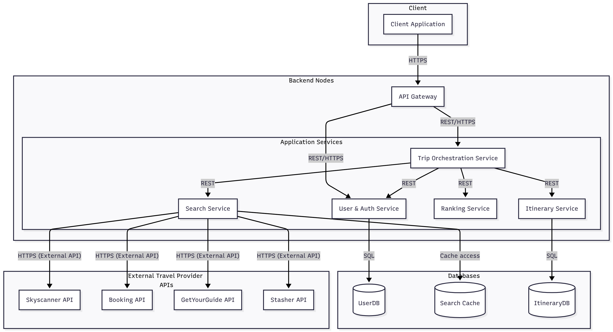
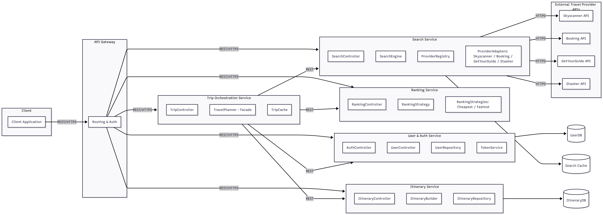
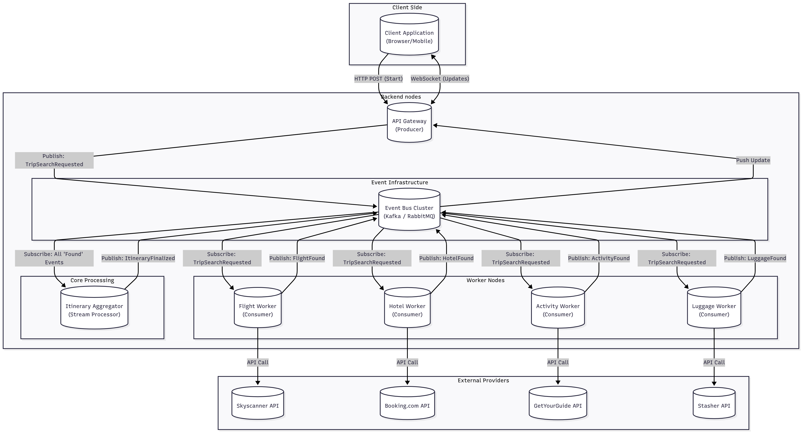
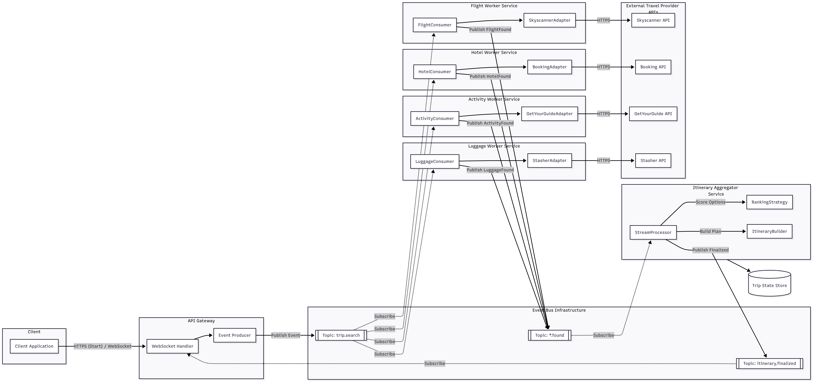

# TravelMate

TravelMate is a single place to plan a trip from end to end:
- search flights, trains, coaches and accommodation;
- automatically combine connections across providers and transport modes;
- get city activities (museums, tours, food spots) with typical time windows;
- find luggage storage options near hubs or attractions;
- receive a unified day-by-day itinerary with times and map routes;

---

## Team Members

- Cristiana Precup
- Nitu-Sararu Gabriela
- Alkhatib Hoda

---

## Problem Statement & Goals

Planning a trip often means switching between many apps. Each app uses different filters, units, and formats. It is hard to compare options across transport types. Also, ideas for what to do at the destination are rarely linked to your transport and hotel choices.

---

### Goals
Deliver a clear end-to-end planning flow (explore → search transport → build connections → choose lodging → pick activities → see one unified itinerary) by turning data from different providers into a single common format for consistent searches and results.

---

## Key Features
- Multimodal Search: find flights, trains, and coaches with filters (price, duration, stops, baggage).
- Smart Connections: combine segments safely (minimum transfer times, layover checks).
- Accommodation: search hotels/hostels/apartments with filters (price, rating, distance).
- City Activities: discover POIs and tours with typical opening times and durations.
- Luggage Storage: see nearby storage spots and available time windows.
- Unified Itinerary: day-by-day plan with times, walking/transfer estimates, and map route links.
- Ranking Options: sort results by cheapest, fastest, eco, or a balanced mix.
- Export/Share: serializable itinerary (e.g., JSON) so the plan is easy to share and reproduce.

---

## Design Patterns

### 1) Adapter
Purpose: Different providers (air, rail, coach, hotels, activities, luggage) have distinct APIs and data shapes. The Adapter hides these differences behind a shared interface.

#### Advantages:

Clean separation between our core logic and external services.
Easy to add or replace a provider without changing the rest of the system.
Improves testing-mock the unified interface instead of real APIs.

### 2) Strategy
Purpose: Users prefer different ranking goals (cheapest, fastest, eco, mixed). The Strategy pattern lets us plug in the scoring method the user selects.

#### Advantages:

Eliminates long if/else chains in ranking logic.
Allows new ranking strategies without touching the search engine.
Simplifies testing for each algorithm.

### 3) Builder
Purpose: An itinerary contains many interdependent parts (segments, hotel nights, visits, transfers). Builder assembles them step-by-step while keeping the result valid.

#### Advantages:

Prevents inconsistent plans (e.g., wrong time order, missing transfers).
Makes creation of complex objects clearer and safer.
Enables immutable, validated final itineraries.

### 4) Facade
Purpose: The UI should not coordinate adapters, strategies, and pipelines directly. A Facade exposes high-level entry points like “plan trip” or “search lodging,” hiding internal complexity.

#### Advantages:

Keeps the UI simple and stable even as internals evolve.
Reduces coupling between presentation and core layers.
Makes end-to-end testing easier and clearer.

---

## **Software Architectures**

### **2. Microservices Architecture**

### **2.1 Description**

The system is decomposed into multiple independent microservices, each responsible for a specific domain in the trip-planning workflow.
Services communicate through REST/HTTPS, and each microservice manages its own database (or cache).

This architecture enables **independent scaling**, **parallel development**, **fault isolation**, and **high availability**, especially when integrating multiple external travel data providers.

---

### **2.2 Key Components**

| **Microservice**               | **Responsibilities**                                                   | **Patterns** |
| ------------------------------ | ---------------------------------------------------------------------- | ------------ |
| **User & Auth Service**        | User registration, authentication, token validation, user preferences  | Repository   |
| **Trip Orchestration Service** | Coordinates search, ranking, and itinerary steps                       | **Facade**   |
| **Search Service**             | Communicates with external APIs (flights, hotels, activities, luggage) | **Adapter**  |
| **Ranking Service**            | Scores trip combinations (Cheapest, Fastest, Balanced)                 | **Strategy** |
| **Itinerary Service**          | Builds and stores user itineraries                                     | **Builder**  |
| **API Gateway**                | Routes client requests to appropriate microservices                    | –            |
| **Client Application**         | Web UI / Mobile Client                                                 | –            |

---

### **2.3 Structure & Data Flow**

#### **System Structure:**

* Each microservice is an independent deployable unit
* **API Gateway** handles routing, authentication, and request aggregation
* Services communicate via **REST/HTTPS**
* Each microservice manages its own data storage
* **Search Service** integrates securely with external travel APIs (Skyscanner, Booking, GetYourGuide, Stasher)

#### **Data Flow Example (Plan Trip Request):**

1. User submits trip details → request sent to **API Gateway**
2. Gateway authenticates user → forwards to **Trip Orchestration Service**
3. **Search Service** fetches flights, hotels, activities, luggage (via external APIs)
4. Results sent back to **Trip Orchestration Service**
5. **Ranking Service** evaluates combinations (**Strategy**)
6. Best trip is passed to **Itinerary Service** to assemble itinerary (**Builder**)
7. User preferences retrieved from **User & Auth Service**
8. Final itinerary stored in DB and returned to user through **API Gateway**

---

### **2.4 Architecture Diagrams**

#### **Deployment Diagram:**

> *Shows the Event Bus as the central hub, with independent service containers connecting to it. The Client Application maintains a persistent WebSocket connection to the Gateway.*

#### **Component Diagram:**

> *Shows internal structure of each microservice and the applied design patterns (Facade, Adapter, Strategy, Builder).*

---

### **2.5 Pros and Cons**

#### **Advantages:**

* **Independent Scaling:**
  Search Service can scale separately during peak travel queries.

* **Fault Isolation:**
  Failure in Search Service does not affect User Auth or Itinerary.

* **Parallel Development:**
  Teams can develop Search, Ranking, and Itinerary services independently.

* **Technology Flexibility:**
  Each microservice can use its own language or framework.

* **Better Maintainability:**
  Smaller and more focused codebases.

#### **Disadvantages:**

* **Increased Complexity:**
  More microservices = more orchestration, logging, monitoring.

* **Inter-Service Communication Overhead:**
  Higher network latency and need for retries and circuit breakers.

* **Deployment Complexity:**
  Requires Docker/Kubernetes, CI/CD pipelines, and service discovery.

* **Data Consistency Challenges:**
  Multiple databases require careful synchronization.

#### **Project-Specific Considerations:**

* Ideal for scaling **Search** and **Trip Orchestration** independently
* Best suited for integrating many external providers
* Supports dynamic ranking and trip-building logic
* Requires more DevOps infrastructure compared to a monolithic setup

---

### **3. Event-Driven Architecture (EDA)**

### **3.1 Description**

The system is designed as a collection of decoupled services that communicate asynchronously via an Event Bus. Instead of waiting for synchronous responses (blocking calls), services publish **events** (state changes) and subscribe to relevant topics.

This architecture transforms the trip-planning process into a **reactive stream**. The user does not wait for a full search to complete; instead, the interface updates in real-time as disparate providers (flights, hotels) publish their findings to the event stream.

---

### **3.2 Key Components**

| Component                 | Role        | Responsibilities |
|---------------------------|-------------|------------------|
| Api Gateway               | Producer    | The entry point. It accepts the `HTTP request` from the user, validates it, and publishes the `TripSearchRequested` event to the bus. |
| Event Bus                 | Middleware  | The central backbone (`Kafka` or `RabbitMQ`) that routes messages to subscribers. |
| Provider Search Services  | Consumers   | Independent services for Flight, Hotel, Luggages and Activity that listen for search requests, query external `APIs` and publish `OptionFound` events. Uses `Adapter` |
| Itinerary Aggregator      | Processor   | Subscribes to all `OptionFound` events, collects results and applies the `Strategy` pattern to rank them. Uses `Strategy` & `Builder` Patterns. |
| Client Application        | Consumer    | Listens for the final `ItineraryCreated` event and pushes the `JSON` result to the user's browser via `WebSockets`. |

---

### **3.3 Structure & Data Flow**

#### **System Structure:**

* **Asynchronous Communication:** No service calls another directly, all communication goes through the **Event Bus**.
* **Decoupled Services:** The **Flight Search Service** does not know the **Itinerary Service** exists, it only knows how to publish a **Flight Found** event.
* **Push-Based UI:** The client application uses **WebSockets** to receive data as it becomes available, rather than polling.
* **Resilience:** Services can be down for maintenance without losing data, events persist in the queue until the service is back online.

#### **Data Flow Example (Reactive Search):**

1. User clicks **Plan Trip** - Trip Event Producer publishes **TripSearchRequested**.
2. **Flight Service**, **Hotel Service**, and **Activity Service** all consume this event simultaneously.
3. Each service queries its external **APIs** (Skyscanner, Booking, etc.).
4. As soon as data arrives, **services** publish events: FlightFound, HotelFound, ActivityFound.
5. **Itinerary Aggregator** consumes these events, storing them in a temporary Trip Context.
6. Once a threshold is met (or timeout reached), the **Aggregator** ranks options (Strategy) and builds the plan (Builder).
7. **Aggregator** publishes ItineraryFinalized.
8. **Client Application** receives the final itinerary instantly via its WebSocket subscription.

---

### **3.4 Architecture Diagrams**

#### **Deployment Diagram:**

> *Shows communication flow between Client, API Gateway, Event Bus, internal services, external travel APIs, and individual databases.*

#### **Component Diagram:**

> *Shows internal structure of each service, highlighting event producers and consumers, and the design patterns used.*

---

### **3.5 Pros and Cons**

#### **Advantages:**
* **High Responsiveness:**
  The Client Application shows results immediately as they stream in, rather than showing a "Loading..." spinner for 30 seconds.

* **Decoupling:**
  New services (e.g., a "Price Drop Alert" service) can be added to listen to existing events without touching the core code.

* **Fault Tolerance:**
  If the "Hotel Worker" crashes, the "Flight Worker" continues working. Messages are queued until the service recovers.

* **Peak Load Flattening:**
  The Event Bus acts as a buffer during high traffic, preventing services from being overwhelmed.

#### **Disadvantages:**

* **Increased Complexity:**
  Tracking a request through the system is difficult (no single stack trace). Debugging requires distributed tracing tools.

* **Eventual Consistency:**
  The system state is not consistent instantly. A user might see a flight in the Client App that becomes unavailable milliseconds later.

* **Operational Overhead:**
  Managing and scaling a message broker cluster (Kafka/RabbitMQ) is complex.

* **Learning Curve:**
  Requires knowledge of message brokers, topic partitioning, and asynchronous programming patterns.

#### **Project-Specific Considerations:**
* Best suited if the goal is a "Real-Time" user experience (like a stock ticker for travel options).
* Ideal if integrating with providers that have vastly different response times (e.g., Flights take 1s, Trains take 10s).
* Allows for advanced features like "History Replay" or "Analytics" by simply re-reading the event log.

---

## **4. Architecture Comparison & Conclusion**

| Feature            | Monolithic                                | Microservices                                 | Event Driven (EDA)                                   |
|--------------------|-------------------------------------------|-----------------------------------------------|------------------------------------------------------|
| Complexity         | Low (Simple to build and debug)           | Medium (Distributed systems challenges)       | High (Async flows and message brokers)               |
| Scalability        | Low (Must scale entire app)               | High (Scale specific services like Search)    | High (Elastic scaling of consumers)                  |
| Fault Tolerance    | Low (One crash kills app)                 | High (Service isolation)                      | Very High (Messages persist if service is down)      |
| Real Time UX       | Low (User waits for all results)          | Medium (Standard HTTP wait times)             | High (Results stream in instantly)                   |
| Deployment         | Simple (1 JAR file)                       | Complex (Docker or Kubernetes required)       | Complex (Docker plus Kafka cluster)                  |
| Data Consistency   | Strong (ACID transactions)                | Eventual (Distributed databases)              | Eventual (Async updates)                             |
| Development Speed  | Fast (Initial setup)                      | Medium (Interface agreements needed)          | Slow (Complex wiring setup)                          |

After evaluating all three options, the **Microservices Architecture** is considered the most suitable for a production-ready version of the TravelMate system.

### **Why Microservices?**
While the Monolithic approach was perfect for our Proof-of-Concept (POC) to demonstrate design patterns, it is not viable for a real-world travel aggregator. Conversely, Event-Driven Architecture, while powerful for real-time updates, introduces complexity that may be overkill for a straightforward planning query.

**Microservices** provide the perfect balance for the following reasons:

1. Independent Scaling of Providers: TravelMate integrates different APIs. Flight searches (Skyscanner) get 100x more traffic than Luggage storage searches (Stasher). Microservices allow us to deploy 50 instances of the Search Service but only 2 instances of the Itinerary Service, optimizing cloud performance. In a Monolith, we would have to scale the entire application unnecessarily.
2. Fault Isolation: External Travel APIs are unreliable. If the Booking.com API hangs or crashes, it could block threads in a Monolith, bringing down the entire TravelMate app. In a Microservices architecture, only the SearchService would be affected. Users could still log in, view past trips, and search for flights.
3. Manageable Complexity: Compared to Event-Driven Architecture, Microservices use standard REST/HTTP patterns that are easier to debug, test, and reason about. We avoid the "hidden control flow" issues of EDA while still gaining the benefits of a distributed system.